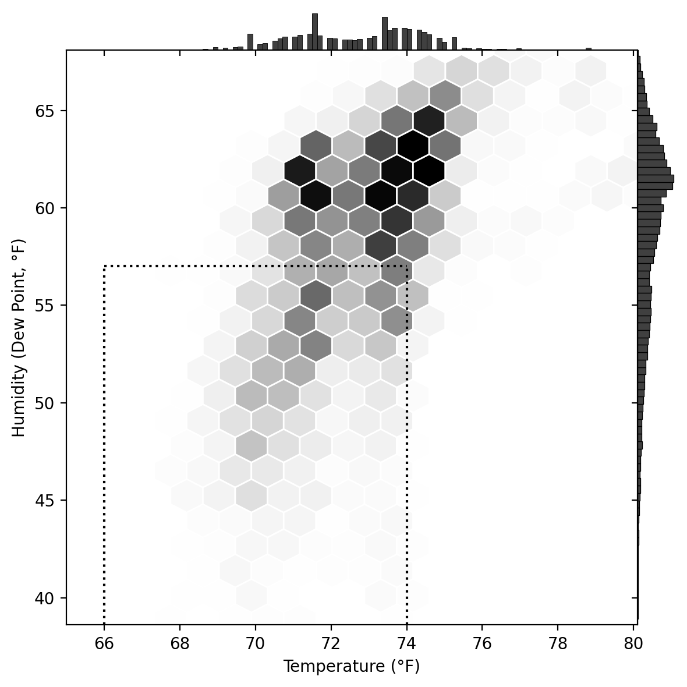
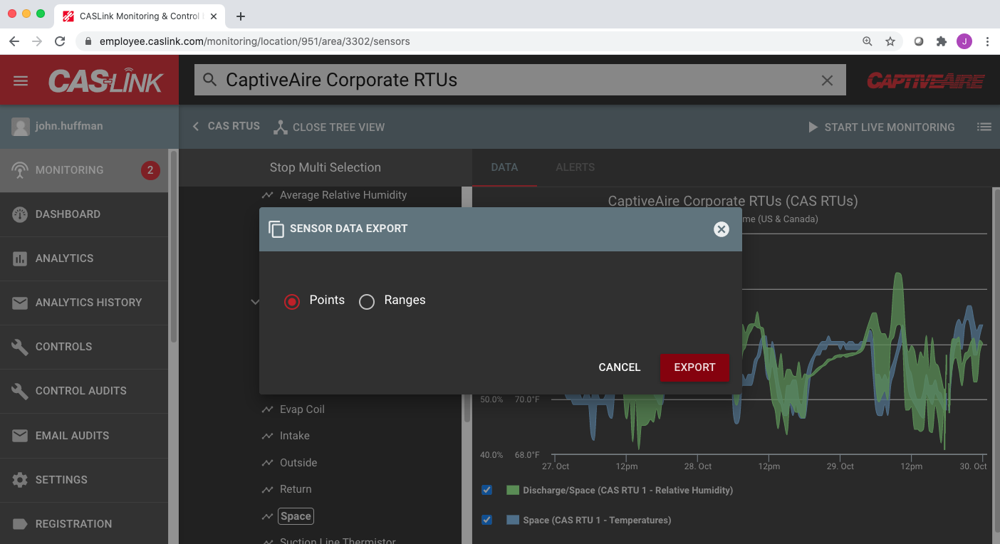
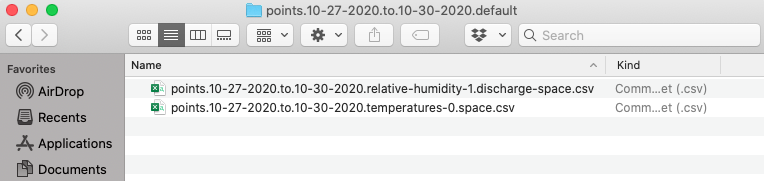
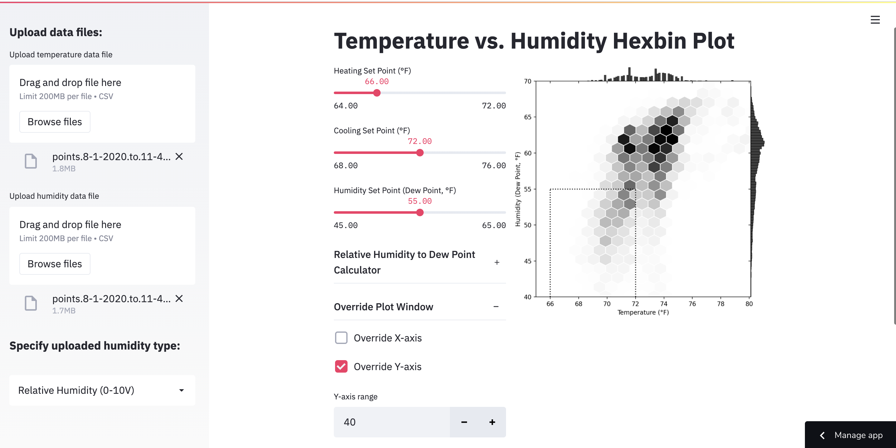

# temp-humidity-hexbin

 

*Author: John Huffman*

This interface, `app.py`, is a tool to quickly generate a [seaborn.jointplot](http://seaborn.pydata.org/generated/seaborn.jointplot.html) hexbin visual to summarize space conditions of HVAC equipment relative to the target set points. The tool ingests temperature and humidity time-series files, synthesizes the files based on timestamp, and generates a visual that can be fine-tuned through the simple user interface. 

## Getting started

1. Wrangle desired temperature and humidity time-series data. Raw data exported from [CASLink](https://caslink.com) will be directly compatible. However, any `.csv` file formatted per the table below with `str` DateTime and `float` RawValue columns will be compatible.

|DateTime|RawValue|
|---|---|
|5/31/2020  11:01:55 PM|71.825|
|5/31/2020  11:03:56 PM|71.775|
|5/31/2020  11:05:57 PM|71.65|
|...|...|

2. No naming convention is required. Simply drag-and-drop files into the app and select the appropriate uploaded humidity data type from "Dew Point", "Relative Humidity 0-10V", or "Relative Humidity 0-100%".

3. Review the default plot and adjust the target set points. Optional plot window overrides are available.

